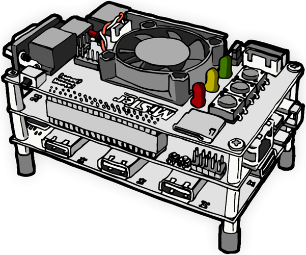
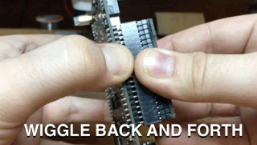
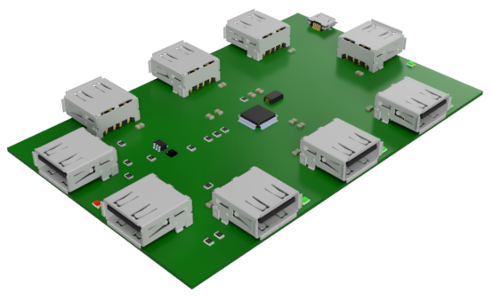
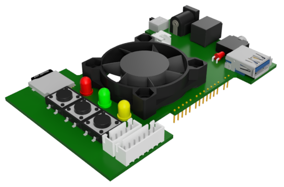
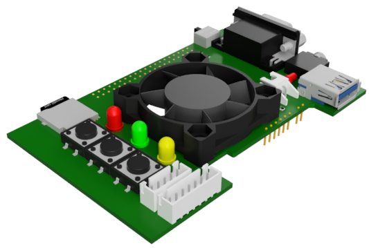
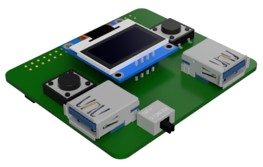
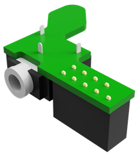

<figure markdown>
  { align=center width="400" }
  <figcaption>Artwork by Hewhoisred</figcaption>
</figure>

MiSTer has various addon boards that are somewhat optional to use such as a 128MB SDRAM add-on board that allows you to use all of the cores on the system and the Analog IO board which enables you to easily connect your MiSTer to a classic CRT telivision or monitor. These boards can be purchased by various sellers online or assembled yourself by ordering the PCB from a PCB manufacturer, buying the components online, and soldering it yourself. 

Here's a rundown of what some of the current add-on boards are and what they do.

## [128MB SDRAM Addon Board](https://github.com/MiSTer-devel/Hardware_MiSTer/blob/master/releases/sdram_xsds_2.9.pdf){target=_blank}

<figure markdown>
  { align=center }
</figure>

The 128MB SDRAM Add-on board for MiSTer is essential for multiple cores to even load games. You can alternatively go with a 32MB SDRAM board for a cheaper price, however there are some games on Neo Geo, Game Boy Advance, and a few other cores which might not be compatible if you go with the smaller sized module.

When plugging in the SDRAM board, make sure to support the DE10-Nano from beneath with your thumbs. Forcing in the SDRAM board without support can bend the DE10-Nano board and permanently damage it.

Removing the SDRAM board can be tricky for some GPIO connectors and just pulling won't do it sometimes. For very tight connectors, it is recommended to wiggle the SDRAM board back and forth to remove the connectors slowly, bit-by-bit. Just pulling with force will often bend the GPIO header.

## [USB Hub Addon Board](https://github.com/MiSTer-devel/Hardware_MiSTer/blob/master/releases/USBHub_2.1.pdf){target=_blank}

<figure markdown>
  { align=center }
</figure>

The USB Hub Add-on board for MiSTer has two methods of connecting to your DE10-Nano either via internal headers with a slim external board or with a bridge to connect both MicroUSB ports together. This board provides an OTG USB Hub for the MiSTer which has one power-only usb port in the back and 6 USB 2.0 ports ont he other 3 sides. It requires power so you may need a power splitter to supply power to both the DE10-Nano and this USB hub. If you use a Digital IO board you will only need a DC to DC jumper cable and a single cable to the Digital IO board's barrel jack in order to power the whole stack.

## [Digital I/O Addon Board](https://github.com/MiSTer-devel/Hardware_MiSTer/blob/master/releases/iobrd_dig_1.2.pdf){target=_blank}

<figure markdown>
  { align=center }
</figure>

Get this board if you want a few more options. It is cheaper than the Analog IO board below typically, and it leaves the 2nd SDRAM slot unoccuppied for the potential future cores which may require it someday.

* 3 Buttons, Reset, On-Screen Display (OSD), and User (for various user interactions without a keyboard)
* 3 status LEDs, Power, Disk, and User
* Secondary MicroSD card slot that may be required by some older computer cores. This is not typical MicroSD storage, think of it as like a little floppy drive.
* Mini-TOSLINK optical digital audio port.
* Full size TOSLINK optical digital audio port.
* User IO Port. This is a port that **looks** like it is USB 3.0 but it **is not!** This is actually used for direct serial communication with various peripherals and adapters like [SNAC adapters](https://github.com/blue212/SNAC){target=_blank} and [MT32-Pi](https://github.com/dwhinham/mt32-pi){target=_blank}.
* Fan Power header and fan mounting holes for better cooling.
* **Doesn't** use the 2nd set of 2x20 headers on the DE10-Nano so it is compatible with Dual SDRAM configurations.

## [Analog I/O Addon Board](https://github.com/MiSTer-devel/Hardware_MiSTer/raw/master/releases/iobrd_6.1.pdf){target=_blank}

<figure markdown>
  { align=center }
</figure>

Get this board instead of the Digital IO Addon board if you want to use your MiSTer for simultaneous video output to a CRT and HDMI monitor. Otherwise the cheaper Digital IO board should be sufficient.

* 3 Buttons, Reset, On-Screen Display (OSD), and User (for various user interactions without a keyboard)
* 3 status LEDs, Power, Disk, and User
* Power On/Off Switch.
* Barrel jack which can be used to power the DE10-Nano with.
* Secondary MicroSD card slot that may be required by some older computer cores. This is not typical MicroSD storage, think of it as like a little floppy drive.
* VGA port for analog video output - See [Advanced - CRT](../advanced/crt.md) for the potential connectivity options.
* Simultaneous analog video and HDMI video output is possible with this board.
* Sync-on-green override\auto switch.
* 3.5mm analog audio port that is also a Mini-TOSLINK optical digital audio port at the same time.
* 3.5mm audio-in port for ADC-in (like Tape input for some computer cores).
* User IO Port. This is a port that **looks** like it is USB 3.0 but it **is not!** This is actually used for direct serial communication with various peripherals and adapters like [SNAC adapters](https://github.com/blue212/SNAC){target=_blank} and [MT32-Pi](https://github.com/dwhinham/mt32-pi){target=_blank}.
* Fan power header and fan mounting holes for better cooling.
* Uses the 2nd set of 2x20 headers on the DE10-Nano so it is **not** compatible with Dual SDRAM configurations.

## [MT32-Pi Lite MiSTer Addon Board](https://github.com/MiSTer-devel/Hardware_MiSTer/blob/master/releases/MT32Pi_lite.pdf){target=_blank}

[MT32-Pi](https://github.com/dwhinham/mt32-pi/wiki){target=_blank} is a baremetal emulator of the Roland MT-32 synth module. This add-on board is Sorgelig's rendition of the new version that utilizes a Raspberry Pi Zero 2 W. This board plugs into the side of the MiSTer into the User IO port on either the Digital IO board or the Analog IO board. Get this board if you want to listen to upgraded Midi sounds in certain cores and games that support it, like the ao486 core or the X68000 core. Here's a video by youtuber MiSTer Walrus FPGA [showing off how the MT32-Pi sounds](https://www.youtube.com/watch?v=q05ud_eNU8E){target=_blank}.

## [MT32-Pi Raspberry Pi HAT Addon Board](https://github.com/MiSTer-devel/Hardware_MiSTer/blob/master/releases/MT32Pi_Main.pdf){target=_blank}

<figure markdown>
  { align=center }
</figure>

This is a Raspberry Pi HAT add-on board for the [MT32-Pi](https://github.com/dwhinham/mt32-pi/wiki){target=_blank}. It is intended to be used with the Raspberry Pi 3A+ due to it's square shape, but the 3B and 4 will work just fine as well. You will also need a short USB Type A 3.0 Male to Male cable if you choose this option.

## [Real Time Clock Addon Board](https://github.com/MiSTer-devel/Hardware_MiSTer/blob/master/releases/rtc_1.3.pdf){target=_blank}

<figure markdown>
  { align=center }
</figure>

There is a Real Time Clock add-on board. If you want to add a real-time clock to your MiSTer you will require this. Various [MiSTer FPGA cores use the Real-Time Clock](../cores/features/rtcsupport.md) feature. For more detailed information on how the board works and how to use it, check the [Advanced - Add-On Boards - RTC Board](../advanced/rtc.md) section of this documentation page for more information.

## [ADC Analog Audio Input Addon Board](https://github.com/MiSTer-devel/Hardware_MiSTer/blob/master/releases/ADCin_1.1.pdf){target=_blank}

<figure markdown>
  { align=center }
</figure>

The ADC Add-on board for MiSTer allows you to use either recordings of computer tape audio or actual retro tape players to send data over analog audio into certain computer cores.

## Where to buy?

If you'd like to buy a board from a vendor online (instead of soldering one yourself), the MiSTer FPGA Forums have a [Hardware Sellers forum](https://misterfpga.org/viewforum.php?f=34){target=_blank} just for that purpose. Here's a list of some hardware sellers from that forum and elsewhere, for your convenience:

* [MiSTerAddons.com](https://misteraddons.com){target=_blank} (USA)
* [UltimateMiSTer.com](https://ultimatemister.com/){target=_blank} (Portugal)
* [MiSTerFPGA.co.uk](https://misterfpga.co.uk){target=_blank} (United Kingdom)
* [AntonioVillena.com](https://antoniovillena.com/){target=_blank} (Spain)
* [LegacyPixels.com](https://www.legacypixels.com/mister/){target=_blank} (USA)
* [CAMInventions.com](https://www.caminventions.com/){target=_blank} (Australia)
* [ManuFerHi.com](https://manuferhi.com/c/mister-fpga){target=_blank} (Spain)
* [MiSTer-FPGA.de](https://www.mister-fpga.de/sonstiges/mister-fpga-emu-2-0/mister-kaufen/){target=_blank} (Germany)
* [RetroCastle AliExpress store](https://www.aliexpress.com/store/912024455){target=_blank} (China)

This is not an official endorsement of any sellers, merely a collection of links. Any hardware failures or shipping failures you have should prompt you to reach out for support from the vendor you purchased your board from first.
