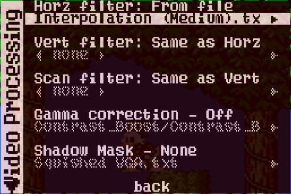
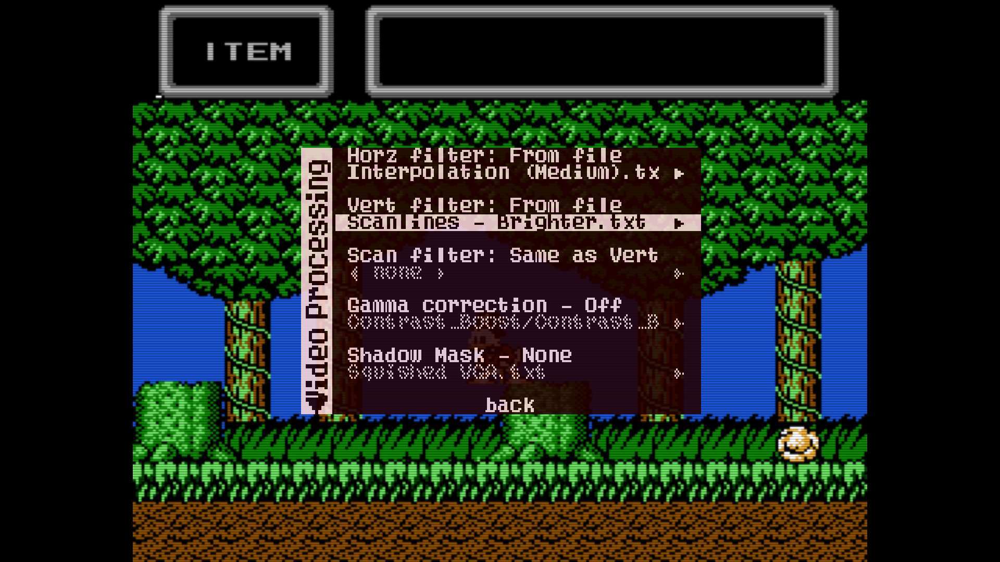
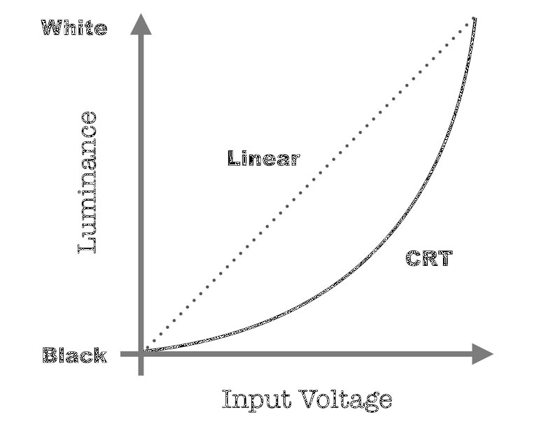
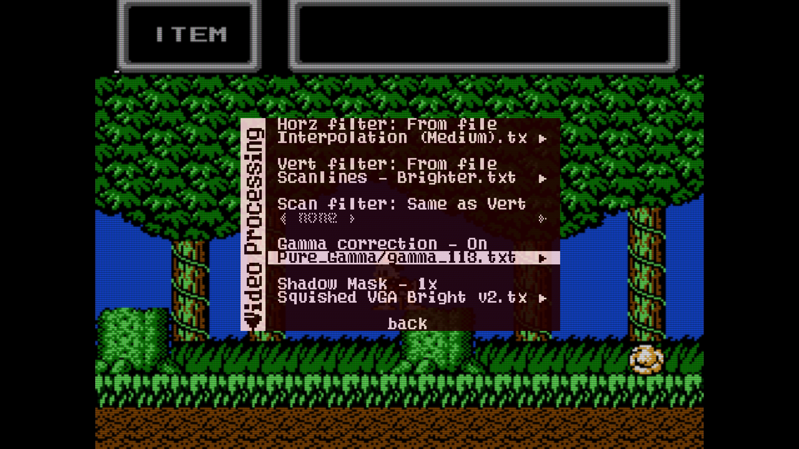

Here's a description of some basic video customization features on the MiSTer. You can change your resolution, modify the framebuffer to reduce input latency and video stuttering, add some video filters, use shadowmasks, and even gamma correction. Also, you can use 5x overscan mode to push a 1200p image into 1080p for square pixels and nearly the original overscan of a CRT, depending on the game's resolution. There are lots of options to play with, here's some basic ones.

## MiSTer Ini Video Settings
In the [MiSTer.ini](../advanced/ini.md){target=_blank} file there are many video setttings to try. We'll just focus on a couple here for now and you can dive deeper into things like CRT usage in the [Advanced - CRT](../advanced/crt.md){target=_blank} section.

First, you can edit the settings in the `MiSTer.ini` file with windows Notepad, Visual Studio Code, Notepad++. Pretty much any text editor will be fine. Alternatively you can run the `ini-settings.sh` script in the scripts folder, this has a simple interface to change options.

### video_mode
A bit of a ways down the .ini file there is a `video_mode` option. Above it the resolutions are commented:

```
; 0 - 1280x720@60
; 1 - 1024x768@60
; 2 - 720x480@60
; 3 - 720x576@50
; 4 - 1280x1024@60
; 5 - 800x600@60
; 6 - 640x480@60
; 7 - 1280x720@50
; 8 - 1920x1080@60
; 9 - 1920x1080@50
;10 - 1366x768@60
;11 - 1024x600@60
;12 - 1920x1440@60
;13 - 2048x1536@60
;14 - 2560x1440@60
```

This tells you that `video_mode=0` will set you to 1280x720 resolution at 60hz. For most people they will probably want to use 1920x1080 resolutiono at 60hz, so my advice would be to change this to `video_mode=8`. You can also use the `ini-settings.sh` script, it will tell you what option selects which resolution, so just select the right one for your display.

There is a detailed explanation of video modes available in [Advanced - Video Modes](../advanced/videomodes.md) thanks to Wickerwaka.

### vsync_adjust
Another important option is `vsync_adjust`. Most modern displays work fine at 60hz, but some games run at 60.6 hz (like Donkey Kong for the arcades) which is a "non-standard refresh rate". Therefore, MiSTer has what is called a "framebuffer". The game is still running at 60.6hz but the frames are sent at 60hz. So occasionally there is a little "stutter" on the screen to make up for the frames going too fast and being adjusted. To use a framebuffer adds a minimal amount of lag. Here's a list of the options and what they do.

```ini
vsync_adjust=0
```
This matches the refresh rate of your monitor (e.g. 60hz) and has about 1-2 frames of lag. Video output can be a little jittery as the core is still running at it's native rate, which isn't exactly 60hz.
```ini
vsync_adjust=1
```
This makes the video output at exactly the frame rate of the game (e.g. 60.6hz). It has 1 frame of lag, but it is less compatible with modern televisions. Video output is very smooth.
```ini
vsync_adjust=2
```
This makes the video output draw to the screen as fast as possible, and can result in sub-frame lag consistently (independent of your controller and display's built-in lag). However this is the least compatible mode and it may result in unplayable behavior on some televisions using certain cores. The video output is the very smooth. Additionally, because of the way this special mode works there is a mismatch in the refresh rate of the scaled output and the core's original video output.

Generally speaking, the rule of thumb is that if you want the smoothest video output and lowest lag then start at `vsync_adjust=2` and if a core doesn't work that you want to play on reduce it to 1 or 0 to see if the compatibility is resolved. Your results may vary depending on the display you are connected to and what core you are using.

### Core exceptions
There are also ways to add exceptions. My monitor doesn't play nice with the low lag setting on the Genesis core. So in my MiSter.ini, I added the following override/exception to the **end of the file** for just the MiSTer core:

```ini
[Genesis]
vsync_adjust=0
```

This makes it so no matter what my `vsync_adjust` setting is in the upper section, when I use the Genesis core, it will force it to use `vsync_adjust=0` (the most compatible mode) every time. You can also add a wildcard to these exceptions so one exception could be applied to multiple cores:

```ini
[dkong*]
vsync_adjust=1
```

This will make it so every core that starts with `dkong` will have the same rule applied to it. You can also make an exception for every single arcade core like so:

```ini
[arcade]
vsync_adjust=1
```

For a list of the internal core names to use in your exceptions see [Developer Reference - Core Names](../developer/corenames.md) for a complete list.

## Video Processing Options Tutorial
Here's a tutorial that you can follow along to get you started using the powerful video processing options on MiSTer FPGA.

### Video Presets
There are now Video Presets that you can choose which will set your filters and everything else to simple desirable settings. They are very easy to use, just open the OSD, press right, then go to video processing, and then "Load Preset". Select the one you want and see if it looks good to you. Here's an example video showing you how easy it is:


### Filters (and scanlines)
MiSTer has the capability to use upscaling filters and scanlines to help enhance the video output or even make it feel similar to a retro CRT television. If you opened the NES core for the first time after setting the MiSter's video output to 1920x1080p and loaded up Duck Tales, then you should see something like this:

[](img/default-video-nes.png){target=_blank}

This can be tweaked a little to make it look a lot nicer to our eyes. First let's go into "Video Processing" in the secondary OSD/Menu (press F12 or the menu button you assigned earlier, and then right to see the secondary menu):


When you select this it will show you a screen with a bunch of options. Don't get overwhelmed, it's fairly simple when you follow this guide, and you will understand how they work. I'll give you some recommended settings for most of the cores at the end of this tutorial which should be your go-to for now while you get used to things.

By default "Video Filter:" is set to "NearNeighbour". This is a nearest neighbour filter. Basically, to turn 240p video into 1080p video requires these pixels to be made larger. Since 240 doesn't divide evenly into 1080 (1080 / 240 = 4.5), then some of these pixels won't be perfectly square. Nearest neighbour helps fool your eyes into making them seem more square than they actually are. It's filtering the video before it reaches your eyes to make it look better! 

Select Video filter to change it so you can select a filters file. You will notice the text changes from `Video Filter:` to `Horz filter:`. Don't worry about this too much, for any normal rotation games, Horz is for your upscaling filters that soften or sharpen the image.

Select the `<none>` below to browse. It should show you quite a few options. For now select `Interpolation (Medium).txt`. This is a filter which gives you some softer edges while still maintaining an illusion of square pixels.



There we go, those pixels are a bit smoother now:

[](img/interpolation-medium.png){target=_blank}

Another added benefit to interpolation is the scrolling looks smoother to the eye when compared to sharper filters like the default Nearest Neighbour setting.

Now let's say you want some scanlines, sorta like what CRT's had and some emulators have an option for. Well to do that, we just need to setup the `Vert Filter:` option like we did the horz filter. You see, we will be filtering horizontal lines from top to bottom (vertically) on the video output. Inside `Vert Filter`'s `From File` option, select `Scanlines - Brighter.txt`. You should see something like this as your options:

[](img/scanlines-brighter.png){target=_blank}

### 5x Vertical Crop (1080p only)
**Note: this feature only works if your output resolution in your MiSTer.ini is set to a 1080p option!!** 

If you have been following along on your MiSTer, you might notice that the scanlines look darker occasionally. This is because 240p (this game's resolution) doesn't divide equally into 1080p (your resolution on your MiSTer). But 240 does divide into 1200 equally, 5 times 240 equals 1200. So to fix these scanlines looking uneven, we can stretch the image vertically to make all the pixels perfectly square. Go back into the regular core menu and select `Video & Audio`. There is an option called `Vertical Crop`. Not all cores have this, but the NES core does happen to, so it's a good example. Go ahead and select the `Vertical Crop` option to change `Disabled` to `(216p)5X`. 

[](img/5x-vertical-crop.png){target=_blank}

You will see just a few lines off the top and bottom get cut off. This is okay, original CRT's cut off about the same amount from the top and bottom anyways. Most games don't have information missing at the edge of the top and bottom.

Now your `vert filter: scanlines - brighter.txt` option should have evenly spaced scanlines vertically, and the image will look a lot better.

### Shadowmasks
MiSTer FPGA also has another layer options available to use called `Shadowmasks`. Shadow Masks are able to modify the red, green, blue color channels to create advanced effects, such as simulating the appearance of the grille or mask on an old CRT screen or the pixel layouts of old LCD handheld consoles. There are lots of options, but we are just going to use personally one of the most versatile color shadowmasks for this tutorial, `Squished VGA Bright v2.txt`. This shadowmask attempts to resemble consumer computer monitors and some tv's which had red, green, and blue phosphors in a particular pattern. Here is a picture of the options after I've added this Shadowmask to the same game's video processing menu:

[](img/squished-vga-bright-v2.png){target=_blank}

### Gamma Curves
Gamma is a bit of a tricky thing to explain. Basically, gamma on an old CRT is the relationship between voltage and brightness. Think of a graph, the x-axis is voltage and the y-axis is the "brightness" (more accurately called luminance). Modern televisions are (ideally) a totally straight line. Old CRT's have a curve. At medium voltage and brightness it is a lot less brightness than you'd expect. Sorta like this:

  
[Image Source](https://www.japanistry.com/understanding-gamma-in-photography/){target=_blank}

Now given that the MiSTer is outputting the linear example, the Gamma filters can restore a similar Gamma curve as you may have been used to with your old television. This is especially helpful because we have just applied a "brighter" scanline and a shadowmask (which added a mask of colors across the screen imitating a CRT's phosphors). If you've been following along with this tutorial so far, we're gonna play with Gamma just to see how it looks to your eyes. This is all personal preference. If it looks good to you, great. If someone else doesn't like it, well... tough! :)

I will apply a very mild "Gamma Curve" called `gamma_113.txt` which is located in the `Pure_Gamma` folder when you select the gamma options. This gamma curve is allegedly supposed to get you close to a typical consumer CRT's gamma curve.

[](img/pure_gamma-gamma_113.png){target=_blank}

## Video demonstrations
Some people like a good video to see how it's done:
### 5x mode video


### gamma controls video

